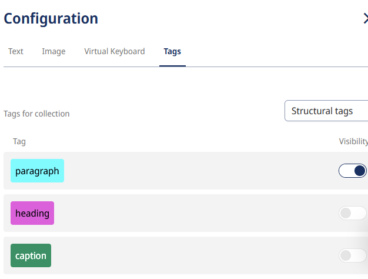
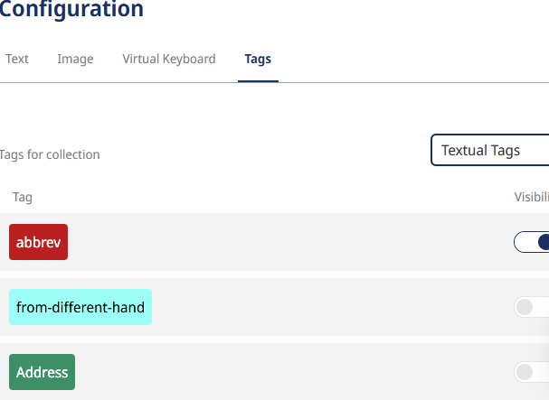
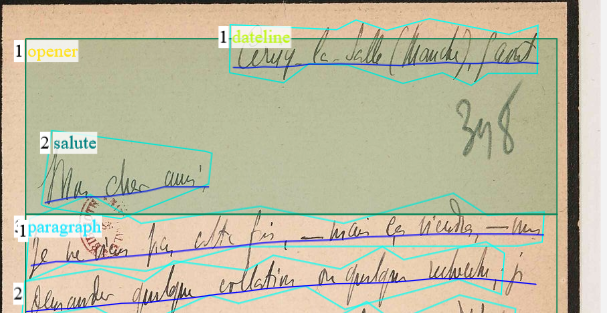

# 2.2 Transcription, ATR and Annotation

## What is Digital Transcription?

Transcription in non-digital editions is carried out by assistant researchers or external transcription services, following established transcription rules. In contrast, the transcription process in DSE involves a number of individual steps and decisions that influence the project's progression. Specifically, as outlined below, these include:

1. the choice of tool and data formats;
2. the level of automation;
3. the workflows in the actual transcription process (creating your own text recognition model, correction steps, possible initial annotations).

Finally, this chapter of the handbook will discuss the limitations of the available standard transcription solutions.

#### Transcription Guidelines

As in print editions, consistent **transcription guidelines** must also be followed for DSE, particularly with regard to **transcription scope** and **diplomatic transcription**, i.e. the degree of coverage of the transcription with the original in terms of linguistic and formal peculiarities. For manuscripts, the question must be answered as to which hands, (special) characters, textual interventions and revision stages are transcribed and how. In the case of prints,  the question also arises regarding print-specific paratexts such as page numbers or bastard titles. The labelling of these formal textual aspects is also referred to as **text-critical annotation**. Depending on the tool (see below), this can be carried out together with the transcription or only later together with the [_content annotation_](../2_Editionsarbeit/05_semantic_annotation.en.md).

!!! abstract "Showcase Edition Guidelines: Transcription and Text-Critical Annotation"

    The Showcase Edition is intended as hypothetical preparatory work for a much larger edition of Gaston Paris's correspondence, comprising around 27,000 pages. If realized in later projects, it will primarily target a **research audience***. Since the developed prototypical workflows are intended to meet scholarly standards of diplomatic editions on one hand, and must remain scalable in scope on the other, it focuses on **the greatest possible textual fidelity with simultaneous simplicity of text-critical and content markup**.

    During the transcription process, the Showcase Edition adhered to the following **text-critical principles**:

    **Scope**

    - **All hands**, i.e. all different manuscripts, are transcribed.
        - Additions by **foreign hands**, i.e. which are not identified as the author's hand in the letter metadata, are identified as such by a text-critical annotation (see below, 3.5).=> Link example from the Showcase Edition here.
        - Exception: Foreign hands are not transcribed if they concern additions of **archive signatures or archive pagination**. Archive signatures are contained in the metadata instead.

    - Since Gaston Paris' letters are largely 'flat' in terms of text-genetics (i.e. they hardly show any traces of his own or other people's revisions), special characters or annotations cannot help with the question of **text-genetic sequences** (which hand can be assigned to which date). When necessary, text-genetic contexts are presented in [_commentaries_](06_commenting.en.md).

    - **Preprinted forms** (e.g. letterheads of hotels or private individuals) on the stationery are usually transcribed and text-critically annotated as 'preprinted forms'. => Link example from the Showcase Edition here.
        - Exception 1: Pre-printed **form lines on postcards** ('Name:', 'First name:', etc.) are not transcribed, as they are common to all postcards.
        - Exception 2: **Postmarks or postage stamps** are not transcribed. The place and date indicated there can be recorded as metadata if it differs from the date of the letter. However, there are editions that label the postmarks in order to make them searchable, e.g. the [Gotthelf edition](=> add link here when published).

    **Diplomatic Transcription**

    - Special characters which Gaston Paris employed specifically for scholarly reasons or borrowed from foreign languages, are used tacitly and are not explicitly listed in a critical apparatus. Their understanding by the specialized audience is assumed.

    - Errors in the original manuscript are included without additional labelling. An error can be easily checked by comparing it with the manuscript displayed next to it.

    - Underlining, including double and triple underlining, and superscripts are transcribed as such.

    - Circling of words or letters is indicated by circling.

    - Conversion to letterspacing or bold type is omitted to preserve the often scientifically motivated emphasis on lemmata.

    - The French space before colons, semicolons and exclamation marks is used tacitly in the transcription. This last point deviates from a strict diplomatic transcription and is based on French printing conventions.

#### Reading Version

A step that technically coincides with text-critical and/or content annotation, but does not itself introduce visible or substantive markings, is the creation of the **reading version**, which is placed alongside the more faithful diplomatic transcription (see also [_edition views_](../3_presentation/03_edition_views.en.md)). In order for the text to be normalized in a reading version, words must be annotated with a correct or modernized variant in cases of incorrect or outdated spellings. The notions of 'incorrect' or 'outdated' must be [_documented_](../3_presentation/04_documentation.en.md) in detail.

!!! abstract "Showcase Edition Guidelines: Reading Version"

    As the Showcase Edition of Gaston Paris' letters is primarily aimed at a scholarly audience, a reading version is not provided during the annotation process. However, it can still be created later, as the TEI/XML data can be enriched at any time using various tools.

#### Linking Digitized Material and Transcription

DSE-specific transcription guidelines concern the **linking of the digitized material and transcription** in the front end, i.e. the insertion of visual word or line correspondences between facsimile and text. Ideally, this is already prepared in the transcription step; all the tools mentioned below have simple forms of this linkage by enriching the XML file of the transcription with image coordinates. The line-by-line text-image linking, which simplifies the autoptic comparison, e.g. by highlighting the text line in the digital copy, has become the standard for DSE and is included below among the documented standard solutions.

!!! success "Best Practice"

    The [Alfred Escher Letter Edition](https://www.briefedition.alfred-escher.ch/home.html){:target="\_blank"} serves as a model for linking the digitized material and transcription using the TEI Publisher.

    The Showcase Edition is based on this form of line correspondence and resuses the existing [source code of the Alfred Escher Letter Edition](https://github.com/stazh/briefedition-escher){:target="\_blank"}.
    <figure markdown="span">

    { width="1000" }
    <figcaption>[Jung, Joseph (Hrsg.), Digitale Briefedition Alfred Escher, Relaunch January 2022, Zürich.](https://briefedition.alfred-escher.ch/briefe/B0056?view1=1){:target="\_blank"} Retrieved on 22.9.2024.</figure>

## 1. Standard Solutions for Transcriptions

Once the text carriers have been selected and digitized, i.e. the [_constitution of texts_](../2_Editionsarbeit/02_Textkonstitution.en.md) has been completed, the texts themselves must be made machine-readable. To do this, the image data of the digitized material, typically available in JPEG or TIFF format, is converted into text data or transcribed. This can be done manually or automatically (see below), and in both cases, the same transcription tools and XML standard data formats can be used.

It is therefore preferable to use a scientific transcription tool for both manual and automated digital transcription rather than a word processing program such as Word. The latter does not support an open XML standard, does not allow transcription and digitized material to be linked via coordinates in XML, and often requires additional data conversions.

Below, we present the most common scientific transcription tools (a list of other tools can be found [here](https://www.adfontes.uzh.ch/ressourcen/quellen-erschliessen/digitale-transkriptionstools){:target="\_blank"} ):

-   [Transkribus](https://app.transkribus.org/){:target="\_blank"} : As of 2024, the **most widely used transcription tool** is distributed by the international cooperative [READ-COOP](https://readcoop.org/de), which is owned by various academic institutions. It offers extensive customer support and has a large user community. Because of this, it also provides the largest collection of AI models for text recognition, developed by individual projects and shared with Transkribus. With its most advanced general AI model, _The Text Titan I_, it surpasses all other known transcription tools as of summer 2024, at least for widely used handwriting styles. However, Transkribus has limited functionality unless a subscription is purchased.
-   [eScriptorium](https://escriptorium.inria.fr/){:target="\_blank"} The code for this Transkribus alternative is provided free of charge by the Université PSL in Paris. It can be installed locally, but requires **its own server infrastructure** or institutional access to an eScriptorium server, as currently operated by various universities. For example, the eScriptorium instance [fondue](https://fondue.unige.ch/){:target="\_blank"} at the University of Geneva is accessible to most Swiss universities. The number of available AI models is currently growing rapidly.
-   [OCR4all](https://www.ocr4all.org/){:target="\_blank"} : Like eScriptorium, this free transcription tool from the University of Würzburg requires installation on a local device or a dedicated server. It is currently less institutionally established than Transkribus and eScriptorium. A key feature of OCR4all is its ability to automate not just the text transcription step, but entire workflows, from uploading to saving in the desired format.
-   [Transcribo](https://tcdh.uni-trier.de/de/projekt/transcribo){:target="\_blank"} is a service offered by the Trier Centre for Digital Humanities at Trier University and part of its FuD research platform (comparable to [Textgrid](https://textgrid.de){:target="\_blank"}, a German research network project). Unlike the tools mentioned above, it allows transcription at the word level rather than just the line level, meaning that each transcribed word is linked to the corresponding word in the digitized text using coordinates. This enables greater accuracy but also makes the manual transcription process more complex. One DSE that uses this tool is the [Johann Caspar Lavater Online Briefedition](https://www.jclavater-briefwechsel.ch/home){:target="\_blank"} .

The Transkribus tool requires the least (project-specific) technical support, which is why we focus on its workflows below. However, many work steps, such as training a model, can also be transferred to other tools.

As mentioned, the tools are also similar in terms of **data standards**. The transcription data can generally be exported in an [XML format](https://www.digitale-edition.at/o:konde.215), such as [PAGE-XML](https://www.digitale-edition.at/o:konde.154) or [ALTO-XML](https://altoxml.github.io/). These are merely preliminary stages for the DSE data standard [TEI/XML](https://www.digitale-edition.at/o:konde.79), in which the edition is ultimately made readable. A [_data conversion_](04_converting.en.md) must therefore take place between the workflow step of transcription in XML (including annotation, which is already possible here) and the more extensive [_content annotation_](05_semantic_annotation.en.md) and [_commenting_](06_commenting.en.md) in TEI-XML.

## 2 Automated or Manual Transcription?

There are still cases where manual transcription is recommended, particularly for manuscript editions. The harder a handwriting is to decipher and the smaller the collection of manuscripts, the less worthwhile ATR becomes. While highly capable general text recognition models like _The Text Titan I_ - especially for Transkribus - are capable of recognizing both printed and handwritten texts, even within the same document, **difficult hands** often exceed their capabilities. In such cases, a handwriting-specific ATR model must be trained (see below). Training such a model requires at least 75 pages of text, and in difficult cases, even 200–300 pages of so-called "ground truth" - a corpus of accurately prepared transcriptions. The ATR process (including training and subsequent corrections) only becomes more efficient than manual transcription once this threshold is reached. In these cases, using a specialized ATR model is justified only if a significantly larger number of pages than the training set will be transcribed.

The decision in favour of automation therefore depends on a cost-benefit calculation. The aim of automatic text recognition is to minimize the correction effort, but in any case to keep it below the effort of manual transcription.
This is typically achieved by gradually expanding the training data with corrected transcriptions and continuously training new text recognition models for subsequent datasets.

## 3 Standard Steps in the ATR Process

If the decision in favour of ATR has been made, it is necessary to test whether an existing ATR model shows satisfactory results or whether a new model should be trained. The standard transcription models maintained by Transkribus are constantly improving and it makes sense to carry out a test run with these models (if you are not aiming for your own model, you can continue with step 3.3).

### 3.1 Training an ATR Model

As mentioned above, Transkribus recommends at least 75 pages of ground truth as a training set for your own transcription models. These can be existing transcriptions that are imported into Transkribus or pages that have been transcribed with the standard models and then corrected.

Previously, Transkribus offered the **"text2image"** function, which aligned existing transcriptions, such as those from historical print editions, with digitized images on a line-by-line basis. Currently, this alignment must be done manually for training purposes. Manually inserting transcriptions into training data is only advisable if standard models cannot be used and corrected efficiently. However, Transkribus has announced plans to reintroduce the "text2image" function by the end of 2024.

!!! note "Experience from the Showcase Edition"
    
    For Gaston Paris' handwriting, the standard model _The Text Titan I_ proved suitable for generating a ground truth through corrections, which in turn enabled the training of a custom model (see next information box). This AI model, similar to ChatGPT, is based on Transformer technology and outperforms conventional ATR models that rely on older AI technologies. While training Transformer models independently is not yet possible with any transcription tool, custom ATR models can still compete with Transformer models by being trained with project-specific ground truth.

### 3.2 Repeated training, re-training

It is generally advisable to create **more than one specific model with the same ground truth**. Although the data remains the same, the AI uses it to create a different model in each training session, which can differ greatly from the previous one in terms of the quality of text recognition. As a rule of thumb, at least four separate training runs should be carried out with a ground truth in order to minimize the randomness of the AI training. For example, the first training may already produce a good result, while the second is significantly worse, the third is the best and the fourth is worse again.

**Re-training with a larger ground truth** differs from repeated training with the same ground truth. When should new data be used to train better models? This decision depends on the specific needs of the project. Key factors include:

-   Quality improvement
-   Correction effort
-   Availability of project members
-   Time required for training

!!! note "Experience from the Showcase Edition"
    
    Using progressively larger ground truth collections (manually corrected transcriptions created with _The Text Titan I_), we conducted several series of re-trainings. The second model in the second series outperformed _The Text Titan I_ in recognizing certain unique idiosyncrasies of Gaston Paris' handwriting. However, the general model still outperformed our custom model in recognizing numbers and different languages.  

### 3.3 Layout Analysis

During layout analysis, an algorithm detects the **arrangement of lines** before the actual text recognition takes place. Unlike text or text region annotation (see section 3.5), this step is not optional. Older versions of Transkribus required layout analysis as a separate preliminary step before ATR, but this multi-step process is now optional. Users can start text recognition immediately, using either a specific or a general model. However, if transcription results are poor, such as missing or partially omitted lines, it is recommended to experiment with different models and configurations for layout analysis.

### 3.4 Correcting Layout Analysis and Transcription

During the correction process, it is advisable to first check the detected lines, especially if they appear fragmented or are missing. If the layout analysis yields poor results, testing different layout analysis models (see above) may be necessary.

If no improvement is achieved, **lines can also be manually adjusted or completely redrawn**. Layout corrections, such as extending a line, can enhance subsequent ATR runs and improve the visual alignment between the transcription and the digitized document in the front end (see our [_Tips_](../Themen/transkribus.en.md)). However, precisely refining the lines may be an unnecessary extra effort, as the comparison remains possible even without perfect alignment, thanks to the visual line overlay.

Transcription errors can simply be corrected within the detected lines. Incorrectly assigned line regions can also be fixed at this stage. However, it is important to note that when using optional word segmentation, individual words cannot be corrected directly - post-processing in Transcribo (https://tcdh.uni-trier.de/de/projekt/transcribo){:target="\_blank"} is an alternative for this step.

### 3.5 Annotations in the Transcription Tool

The last, already optional step in Transkribus and similar transcription tools is the **annotation ('tagging') first of text regions and finally of the text itself**. The first step, determining the text region, is optional, but only regarding when it happens, not whether it happens. The annotation at the region level is a standard feature of a DSE, as it fundamentally structures the text, e.g., into paragraphs, postscripts, verses, etc.

The more detailed annotation of word sequences or words is also part of the standard, but its level of detail is less standardized, and depending on the edition guidelines, may include only a minimal set. A basic distinction is made between **two forms of annotation at the word level**:

- **Critical annotations** characterize visible features of the typeface, such as underlining.
- **Content annotations** characterize semantic properties of the text, such as the definition of a geographical location. This form of annotation will be discussed in more detail [_later_](05_semantic_annotation.en.md).

From a technical point of view, these steps no longer constitute a transcription of the text, but could also take place later in the TEI/XML. However, there are reasons why the annotation of regions and text-critical aspects – i.e., features recognizable in the typeface – is already carried out during the transcription (or its correction): the labeling of different hands, underlining, titles, paragraphs, etc. is already closely linked to it. If the digital copy and the finished or emerging transcribed text have to be compared with each other exactly, it makes sense to record not only the correct (e.g., diplomatic) character sequence but also the **visible peculiarities of the text**.

Transkribus distinguishes between 'structural tags' and 'textual tags', which corresponds to the distinction drawn above between annotation at region level and annotation at word level.

{align=left width="250" } With **structural tags**, self-definable text regions and line regions automatically generated by the layout analysis ('base lines' and associated 'line polygons') can be marked up directly on the digital copy, i.e. on the left-hand side of the user interface. Even if these tags appear on the digital copy for the sake of simplicity, they are saved in the same XML file as the transcription.

{align=right width="250" }**Textual tags** allow tagging at the word level of the transcription and are therefore attached to the transcription text on the right-hand side of the user interface. In addition to formal aspects (underlining, foreign hands), 'textual tags' can also include content-related aspects (tagging of place names or keywords). However, we recommend that the more complex content annotation is only carried out in TEI-XML in order to minimize the conversion effort (see below). Transkribus is also not (yet) capable of automatically linking content annotations to external resources such as standardization data. Even if this should change in the future, as is apparently planned, caution is advised due to the conversion effort involved.

!!! warning "Challenge"
    
    As already mentioned, transcription tools offer markup in PAGE-XML or ALTO-XML, which must be taken into account when converting to TEI-XML.
    It is therefore advisable to **align your markup in the transcription tool with the nomenclature of the TEI/XML you are aiming for**. In this way, TEI syntax-compliant elements are created during conversion to TEI/XML, rather than freely invented expressions or, if not marked up, anonymous blocks (<ab>). The most important elements are automatically recognized by scripts such as Page2TEI and converted into the corresponding TEI elements. This increases complexity, requiring close technical support for the project.

The advantage of annotations in transcription tools is that the most important formal aspects can already be clarified during the initial, surface-level engagement with the text. In the next steps after conversion, content annotation and commenting - which are described in the following chapters primarily using the TEI Publisher - the team can then focus more intensively on the semantic aspects. Projects should consider as early as possible whether, and to what extent, they want to work with the transcription tools' tags, which are easy to use but demanding in the conversion process.

!!! note "Experience from the Showcase Edition"

    We decided to use 'structural' and 'textual' tags in Transkribus only for text-critical aspects (see the Showcase Edition guidelines above). In this annotation of Gaston Paris's letters, we follow the element names suggested by the [German text archive](https://www.deutschestextarchiv.de/){:target="\_blank"} as the [basic format for labelling letters](https://deutschestextarchiv.de/doku/basisformat/brief.html){:target="\_blank"}. To achieve this, we created our own tags in Transkribus and applied them to annotate the text regions on the digital copy. The letterhead, for example, is defined as the text region 'opener'; within this text region, we mark the line with the date and, if applicable, the place as 'dateline' and the greeting ("Mon cher ami") as 'salute'. The body of the text itself is divided into various paragraphs.

    

## 4. Limitations

### 4.1 The Ideal Transcription Tool?

Currently, there is no _one-size-fits-all_ solution for transcription. The tools listed above primarily require **different amounts of support and technical expertise**, but offer similar functionalities. It seems advisable to base the choice of tool more on existing institutional know-how and technical resources than on the tool's capabilities (especially since these capabilities are quite similar across the tools mentioned above). If the institutional expertise is limited and the financial situation allows for a Transkribus subscription, we would advocate for such a subscription.

### 4.2 ATR as a Solution?

The high hopes placed on the scientific applications of AI also extend to ATR models, which are sometimes based on the same technology as large language models (e.g., ChatGPT). While the advances in ATR are currently significant, they are not yet substantial enough - especially for older and/or difficult handwriting - for their use in every DSE project to be considered practical.
Even when using the best available ATR models, the correction effort may exceed that of manual transcription from the outset. Training custom models is time-consuming and doesn't always yield better results. Therefore, it is essential that projects plan a **test phase** to evaluate the available options before creating and training large ground truth collections.

### 4.3 Annotating in Transcription Tools?

The question of how much should be annotated in PAGE-XML or ALTO-XML also depends on the available technical support. We are aware of projects whose workflow involved extensive annotations in Transkribus - not only text-critical ones, but also content annotations - and faced major delays and adjustments to the workflow due to conversion challenges. Therefore, it must be clear from the outset of the project where and which annotations should take place in order to align the complexity of the data conversion with the project resources.
The Showcase Edition has expanded the annotation editor interface so that text-critical annotations can also be done entirely in the TEI Publisher. The process is the same as we have described for [_content annotation_](05_semantic_annotation.en.md).
