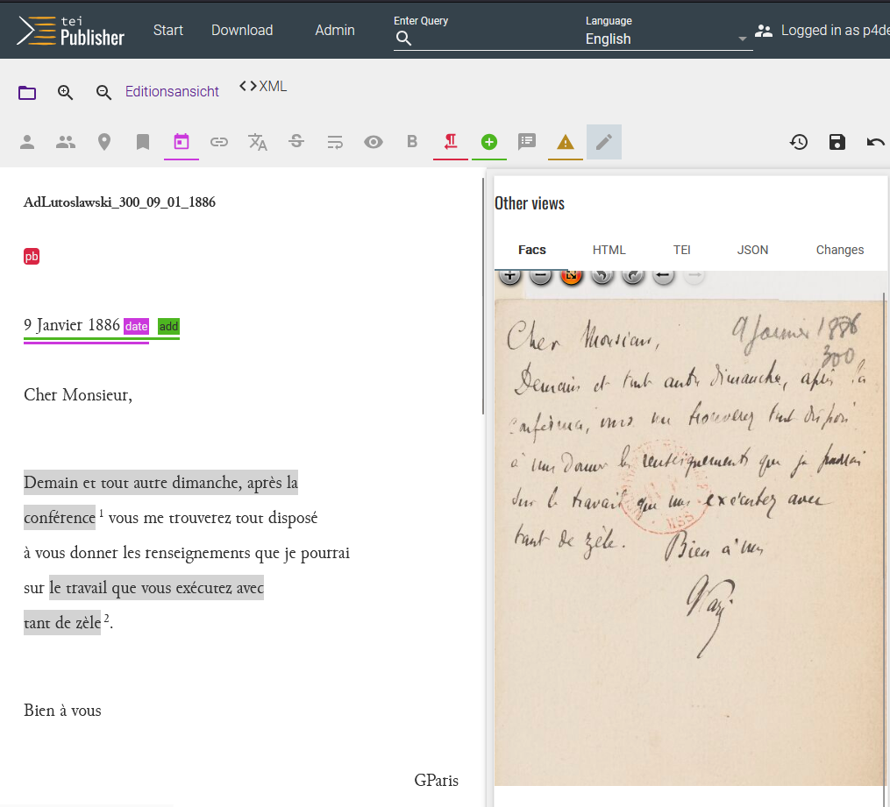

# 2.4 Content annotation

## What does digital content annotation mean?

By _content annotation_ we mean the labelling of a word or word sequence with regard to its **semantic references**. These can refer to the same text (intratextual), other texts/works (intertextual) or any facts (contextual). This chapter will primarily deal with inter- and contextual referencing, as these are the most demanding in terms of editorial research effort and technical tools and interfaces. Nevertheless, projects should not ignore intratextual references, as they make navigation within a larger text much easier.

Common examples:

-   Intratextual content annotations:

    -   Reference of a letter passage to the letter appendix referred to in it;
    -   Reference of a table of contents to the chapters indicated therein.

-   Intertextual content annotations:

    -   Reference of a work implicitly or explicitly thematised in a letter to a bibliographic entry in the DSE register and/or to a library database or - ideally - a [_standard database_](../Themen/authority.en.md);
    -   Reference of a text passage to another text in the same DSE or to a text that was edited in another DSE.

-   Contextual content annotation:
    -   Reference of a text passage to an entry in the DSE's own gazetteer and/or a standards database for geographical data such as [geonames.org](https://www.geonames.org/).
    -   Reference of a text passage to an entry in the DSE's own index of persons and/or in a standards database for personal data such as a person entry in the [Gemeinsame Normdatei (GND)](https://gnd.network/Webs/gnd/DE/Home/home_node.html), the largest standards database for cultural and research data in the German-speaking world.

In contrast to the text-critical annotation, which is often made during the [_transcription_](03_Transkription.en.md) (see 3.5), the annotated text passage appears as a link that makes this reference accessible with a click (alternatively, it can also be identified by a hover/mouseover text). In contrast to [_commenting_](06_commenting.en.md), a content annotation is a **simple reference** that should be **self-explanatory** or at least explained by redirecting to a resource within the edition (e.g. an entry in an index or in a map) or an external resource (e.g. a [_standard database_](../Themen/authority.en.md) such as [GND](https://gnd.network/Webs/gnd/EN/Home/home_node.html)).

Content annotation is an editing task that is specifically created by digital tools, in particular the possibility of linking. It creates the digital equivalent of a **book index** (e.g. a subject, name or place index at the end of a scholarly edition), but has more far-reaching functions and is more complete. The broad networking of annotations with external digital resources promotes the concept of [**Linked Open Data**](https://handbook.opendata.swiss/de/content/glossar/bibliothek/linked-open-data.html){:target="\_blank"}: the visualisation, linking, sharing and integration of openly accessible data sets.

## 1. standard solutions for annotating content

Content annotation can usually be carried out with the same tool as annotation; a close examination of the digitised material is no longer absolutely necessary for both work steps. Transcription tools such as Transkribus do not (yet) offer these work steps, i.e. they do not yet offer the option of creating content annotations as links or comments. Such functions are planned as of summer 2024. However, if implemented, they should be used with great caution, because every additional annotation function in the transcription tool can lead to new challenges in [_conversion_](04_converting.en.md) - at least as long as transcription tools do not yet have the function to [_publish_](../3_presentation/01_introduction_presentation.en.md) TEI/XML data themselves.

Two standard technical solutions are available and their workflows are documented in the next subchapter:

1. the use of a tool that allows both **edition and publication**. The solution tested in detail for this is TEI-Publisher.

2. the use of a **TEI/XML editor** such as Oxygen: In this case, it represents a link between the transcription tool and the publication tool.

## 2. standard workflow steps

### 2.1 Creating the editing guidelines

Regardless of the tool used, it should be clarified at the start of the work step which content needs to be labelled and for what purpose. The guiding question should be which usage scenarios the DSE has to fulfil:

-   Should it collect as much content data as broadly as possible or is the focus on very specific data?
-   What data is this in each case?

Five main categories of inter- and contextual references, as mentioned in the examples above, have emerged in recent years: **personal data, location data, time data, work data and keywords**. While work data and keywords do not appear in every DSE, persons, places and times are now standard.

Somewhat more exotic is the referencing of other categories, for which there are basically no technical limits, e.g. freely selected topics (more specific than keywords), historical events or linguistic characteristics (e.g. the use of foreign languages).

!!! warning "challenge"
    
    From an editorial point of view, the delimitation of categories is always linked to the problem that once a category has been introduced, it must be applied consistently, which can lead to a great deal of effort. In the case of several editors, it requires precise adherence to complex editorial guidelines or constant coordination to adapt them. Complex issues that only need to be made comprehensible in a few texts should therefore be presented in the passage or text [_comment_](06_commenting.en.md).

When planning the annotation of content, the following editorial considerations must be taken into account:

-   Is it primarily the DSE's own index that is central, for example because there are hardly any other data sets on the Internet for it?
-   Or should the register in most cases be an 'intermediate stop' to bundle information and link it to external resources?

Both standard tool solutions allow the **integration of connectors**, i.e. the semi-automated linking of the annotation in TEI-XML with a standards database. Editors can select the correct standards dataset from the connector's suggestions and do not have to research the link themselves and write it in TEI/XML. However, if there is little chance of finding any external standards data at all, the use of connectors is of secondary importance.

It should be considered in detail how often which data should be labelled in a text and which standard data (see below) are referenced for this purpose. For example, it does not make sense to annotate salutations (e.g. you/your) in letters every time, especially if the person being addressed is identical to the recipient of the letter (this information is already available in the letter's metadata). Such considerations, even if they may seem trivial, should also be included in editing guidelines and made available to DSE users.

!!! abstract "Showcase Editing Guidelines: Content annotation"
    
    The project has decided to annotate the three categories of place, person and work, as in the case of Gaston Paris's historical scientific correspondence these are best suited to tracing the scholar's research network, which is at the centre of the project leader's own research.

    - **Places** are, where possible, linked to geonames with their current place name.
        - Places are not labelled if they already exist in the metadata of the letter (place of sending or receiving).

    - In a first step, **Persons** are linked to the personal data in GND. This is the simplest way of linking standardised data, as the link to GND is preconfigured in the TEI Publisher. In a second step, a link via [VIAF](https://viaf.org/){:target="\_blank"} an international aggregator of standards datasets, to [IdRef](https://www.idref.fr/){:target="\_blank"}, the French standards database. IdRef is of central importance in view of the French-language corpus and the Romance research interest, but as of 2024 it cannot yet be automatically linked to the TEI Publisher.
    Personal data that is not yet listed in the GND will be added to the GND independently via a service provided by the GND editorial team at the Zentralbibliothek Zürich and can thus be linked. In this way, the project contributes to improving the GND records with regard to French/romance data.
        - Persons are not labelled in the text if they are already part of the metadata (author:in or recipient:in)

    - **Works** are imported from the project leader's extensive bibliography from the bibliography tool Zotero. The resulting index could be linked to work data from the GND in a second step, but this has not been implemented in the showcase edition.

#### Referencing of standardised data

**Standardised vocabulary** in general and the **GND** in particular strengthen interoperability based on the FAIR principles. The GND, with its 10 million standardised data records on persons, geographies, corporate bodies, conferences, work titles and subject headings, is freely available for reuse. For a long time, it was mainly used for cataloguing material in libraries, but is now increasingly being used for cataloguing collections in archives and museums as well as in various digital project and research contexts such as DSEs. The resources catalogued in this way become compatible with modern search environments, while at the same time the use of controlled vocabulary increases the **retrievability and visibility of the resources**.

During the annotation process, it is helpful to collaborate with a specialised library service in order to close the gap that editing projects often face ("some people who appear in the correspondence do not yet have a GND or VIAF entry", Sarah Rebecca Ondraszek: [Data, Data, there to Crawl, Who's the Fairest of Them All?](https://doi.org/10.58079/nkrq)). The [**GND editorial team of the University Library and Zurich Central Library**](https://www.zde.uzh.ch/de/analytics/openup.html) supports digital edition projects in the active use and independent entry of data records in the GND web form. The GND editorial team provides access and training in working with the web form. As a result, the data you enter yourself is immediately available in the GND and can be linked in the annotation. The editorial team offers an accompanying GND introduction and advises on the subsequent use of the data. In consultation, they also check which persons, places etc. from existing lists or registers are already available in the GND.

The [**Library of Congress Subject Headings**](https://www.loc.gov/aba/cataloging/subject/) (LCSH) plays a central role in subject indexing for the Anglophone area and [**Répertoire d'autorité-matière encyclopédique et alphabétique unifié**](https://rameau.bnf.fr/) (RAMEAU) for the Francophone area, particularly via the Identifiants et référentiels (IdRef). The GND itself also links matching entities of the aforementioned authority files. Furthermore, the collection [**VIAF**](https://viaf.org/) (Virtual International Authority File) automatically brings together several authority files and Wikidata in a standardisation data service hosted by OCLC. While the index link to the GND is directly integrated in the TEI Publisher, IdRef can only be accessed indirectly for annotation via aggregators or concordances.

### 2.2 Content annotation in the TEI Publisher

Since version 7 (as of summer 2024: version 9), the open source software [TEI Publisher](https://teipublisher.com/) has offered the option of enriching TEI/XML data with annotations using a graphical interface. This means that the text to be edited does not appear as TEI/XML and has to be edited as code, but can be displayed in a similar way to the word processing programme Word. However, the coding in TEI/XML can be checked at any time and also manipulated directly, which is sometimes necessary but requires additional expertise.

#### Choice of ODDs

Once the TEI/XML data has been imported into the TEI Publisher, it can be displayed on the tool's user interface using different ODDs (**O**ne **D**ocument **D**oes it all). ODD files (a detailed description can be found in the [Konde Weißbuch](https://www.digitale-edition.at/o:konde.150)) are written in the ODD schema language; they output the TEI/XML code based on different, defined schemas: In the case of the (here text-critical) annotation `<hi rend="underline">rassuré</hi>`, for example, the ODD 'recognises' that the word "rassuré" should be underlined.
[The TEI consortium offers various ODDs and documents their use](https://tei-c.org/guidelines/customization/getting-started-with-p5-odds/); as TEI-XML is a flexible standard, not every annotation must and can be used for the same thing. In German-speaking countries, the [ODD of the German Text Archive](https://www.deutschestextarchiv.de/doku/basisformat/schema.html) has become established for editions in addition to the standard ODDs of the consortium. ODDs can be customised for each project, for example using the online tool [ROMA](https://roma.tei-c.org/).
Technically, there are two different use cases for the ODD, the representation and the validation of the data; actually (i.e. according to the specification) both are intended as part of the same document, but in practice the representation is often defined separately in the TEI publisher environment.

#### Annotation editor

The TEI Publisher has various standard ODDS pre-installed; the revision mode for annotation also has the form of an ODDS. This ODD has the file name 'annotations.odd' and can simply be selected from a page tab. The annotation editor activated by this can be customised, see the [TEI-Publisher documentation](https://teipublisher.com/exist/apps/tei-publisher/documentation/configuring-annotation-editor?action=search&view=div&odd=docbook.odd#3.42.13.63.3); we have also summarised important information in the subchapter [_Annotations with TEI-Publisher_](../Themen/tei-publisher-annotations.en.md).

!!! note "Experiences from the showcase edition"
    
    In order to activate all the required annotations in the edition editor, several attempts, meetings and rounds of revision were necessary. Among other things, the project has recognised the need to display the digitised text, which is relatively small at the bottom of the screen in the annotation editor's default setting, in a larger format to the right of the annotated text. This means that text-critical annotations or corrections to the transcription, for which a comparison with the facsimile is necessary, can also be added.
    The customised annotation ODD of the project is publicly available via GitLab:
    => PASTE PROJECT RESOURCES HERE 

The TEI Publisher stores all content annotation data in an **XML register**, where both standardisation data IDs and your own generated data are stored. The use of an additional database is therefore unnecessary.

### 2.3 Content annotation in Oxygen with and without ediarum

After importing the TEI-XML data into the editor, the annotation is carried out using the [ediarum](https://www.ediarum.org) working environment. Ediarum displays TEI-XML data in a similar way to a Word file and has corresponding formatting buttons. Detailed ediarum [documentation](https://www.ediarum.org/docs.html) exists for [setting up](https://www.ediarum.org/docs/set-up/), [configuring](https://github.com/ediarum/ediarum.SKOS.edit?tab=readme-ov-file#installation) and [using](https://www.ediarum.org/docs/ediarum.BASE.manual) the editing environment and is regularly updated by the ediarum team.

=> This point is enriched by experience from the Schwarzenbach project, whereby the use of ediarum is probably limited to very few functions.

## 4 Limitations

The listed standard ways of annotating content basically have the same **editorial limitation**: The more annotation categories are introduced in the edition, the more difficult it becomes to consistently adhere to the edition guidelines.

On the technical side, two basic limitations can be distinguished:

1. if a **user-friendly annotation interface** such as the annotation editor of the TEI Publisher or the ediarum extension to Oxygen is used, the simpler operation goes hand in hand with a limitation of the annotation options. If these are to be expanded, regular support from a technical specialist and possibly more complex test phases are required.

2. if an **XML editor** such as Oxygen is used, the introduction to the coding work for the purpose of annotation creation is associated with effort; the editing environment is not 'ready to use' and annotation must be practised. Extending and adapting the edition guidelines, on the other hand, requires less technical support.

Which of the two paths requires less effort overall on the technical and editorial side depends on the **dynamics regarding the complexity of a project**: If the editing guidelines for content annotation are simple and set from the outset, the first path is preferable; if the project is complex (e.g. due to a growing corpus that is initially difficult to estimate) and the requirements for the annotations are initially difficult to define, working in the TEI/XML code itself is probably more sensible. The longer technical familiarisation period for editing staff then pays off in the form of greater flexibility.
