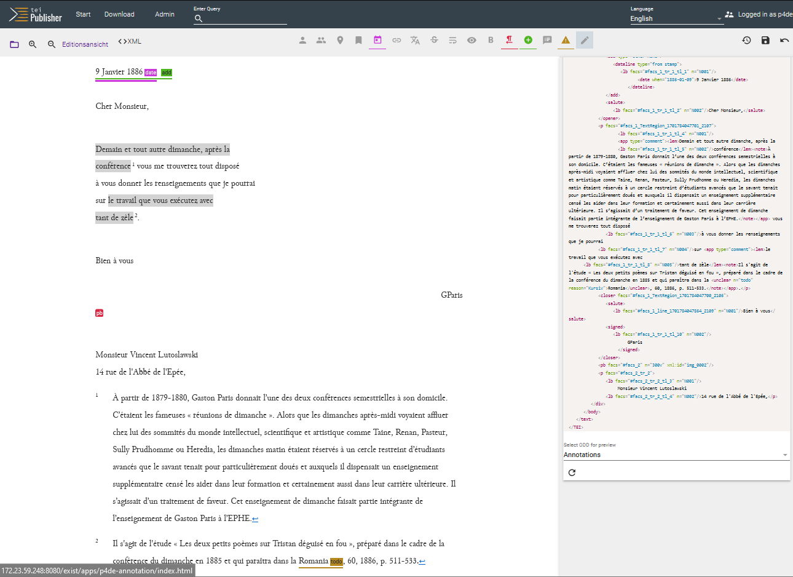

# 2.5 Commentary

## Forms of commentary in DSE

In printed and digital editions, the commentary allows texts to be enriched with contextual information in addition to text-critical and content annotations. Commentaries are usually the result of research, be it research that is closely linked to the [_constituting of text_](02_Textkonstitution.en.md) and thus does not represent a major additional effort, or research that takes place in parallel to the edition project as independent research work and is also used, for example, in essays or monographs.

In classic print editing, three different basic forms of commentary are recognised, all of which are also used in a different form in DSE:

**1. The editorial commentary** (or editor's commentary, editorial report, etc.) explains at least the editorial guidelines, possibly the selection of the corpus based on its genesis and the use of the text-critical apparatus. In DSE, this form of commentary is better known as [_documentation_](../3_presentation/04_documentation.en.md) and will be treated under this name in the chapter Publication.

!!! info "Exemplary DSE"
    In hybrid editions such as the [Faustedition](https://www.faustedition.net/), the editorial report (which applies to the digital and printed editions) and the technical documentation are sometimes separated from each other.

**2. The overview commentary** (or introductory commentary, thematic commentary, commentary on the text as a whole, etc.) refers to the edited content as a whole, be it a subject area, a complex of works or a text. In historical-critical editions, it often serves to summarise content (also called a regest in the case of historical source editions and editions of letters), to shed light on its genesis (text genesis, intertextuality), publication and reception history and sometimes even to provide an overview of interpretations in the secondary literature. Various forms of overview commentaries also exist in DSE, but they are rarely bundled together as one continuous text, but are found on various hierarchical levels closer to the annotated content (e.g: Introduction to the Letters section, introduction to a specific correspondence, individual letter commentary). As these are individual texts that are only loosely linked to the edited text (which can ideally be output as TEI/XML like the edited text), the technical and editorial aspects are less complex and do not need to be explained further.

!!! info "Exemplary DSE"
    The overview commentaries of [edition humboldt digital](https://edition-humboldt.de), which provides a separate introduction to each letter correspondence, are exemplary (the later letter editions in [haller.net](https://hallernet.org) follow a similar approach). In addition to such an "introduction", each of Humboldt's individual travel diaries also contains "research dossiers", some of which go beyond traditional overview commentaries in their level of detail. Such an enrichment of the edition through thematic essays can prove its research value. Finally, edition humboldt digital sometimes also includes a detailed overview commentary at the level of the individual texts. This commentary is called an "Anmerkung" and appears as a hover/mouseover text when the metadata is called up. It is primarily limited to the dating and structure of the individual document.  
    Branching out into various overview comments is not necessary in the case of a single edited text such as a novel. The [overview commentary of the Lokalbericht Edition](https://www.lokalbericht.ch/kommentar) is therefore structured as a continuous text that is closely linked to individual sections of the edition.

3 **The passage commentary** refers to a single text passage, the length of which can range from a single word to passages of several paragraphs. Printed editions are familiar with the commenting of passages in the immediate vicinity of the text (in the margin, as a footnote) or in a commentary apparatus (organised by endnotes, line numbers and/or lemmata). Here too, DSEs have the advantage of linking passage commentaries more closely to the annotated content. Various ways of creating digital passage commentaries are analysed in more detail below.

## Workflows for passage commentaries

At this point, it is not (yet) possible to speak of 'standard workflows' as in the other chapters on editing work, as editions **have very different needs** for annotating passages and often do without them altogether. The need for passage annotations has decreased in comparison to print editions, as many can now be replaced by [_content annotations_](05_semantic_annotation.en.md).

However, if passage commentaries are created, their 'anchoring' or coding in TEI-XML is very standardised, as they are inserted as `<note>` for the sake of simplicity. => Possibly insert a code snippet from the showcase edition here or better link directly to TEI-XML.

The coding in TEI/XML does not say anything about **how the passage commentary is ultimately displayed**; this depends on the choice of ODD and the technology of the publication tool. In the case of the TEI Publisher, passage commentaries are currently displayed as endnotes below the edited text. The endnote anchor in the body text is linked to the endnote (as known from Word, for example) in such a way that the page scrolls to the endnote when it is clicked. For the Showcase edition, we have extended this function so that a hover/mouseover text also appears when the cursor is moved over the endnote anchor.

Since passage comments on the coding side are easy to handle **as annotations**, they can be inserted in the TEI Publisher in the annotation editor. At present, however, they cannot be deleted with the standard configuration in the editor, but must be deleted manually from the TEI/XML file. To avoid having to work too often in TEI/XML, the Showcase edition has decided to initially mark such deletions with a To-Do annotation and to carry them out later in a bundle.

For the standardised application of passage comments, it makes sense to define these in the editing guidelines.

!!! abstract "Showcase edition guidelines: Commentary"
    => @ Ursula: We have not yet defined actual commentary guidelines, commenting is primarily your area of expertise. Why should what be commented on and when?
