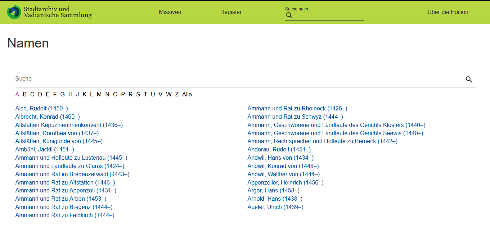
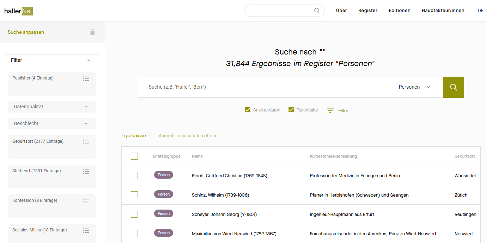
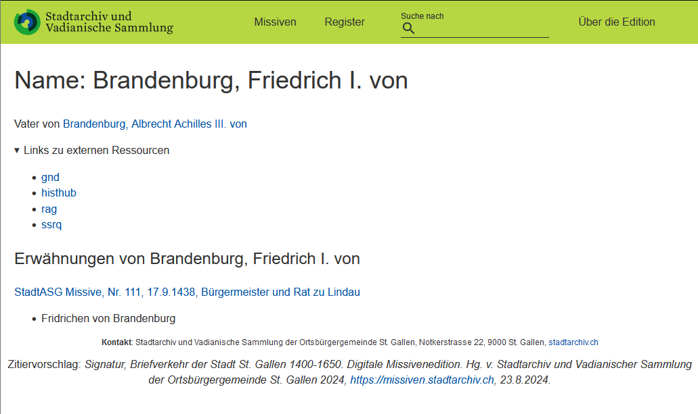
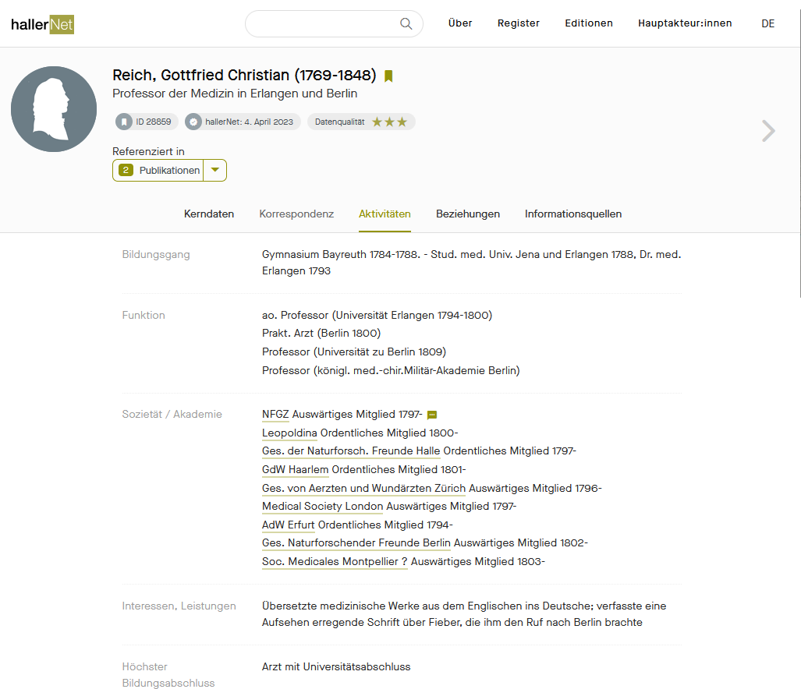

# 3.1 Entry Points: Pages, Search Functions, and Indexes

The way users access a digital scholarly edition (DSE) depends on the **intended audience** — both those the DSE aims to reach and those it may implicitly exclude. Within DSE projects, there is often lively debate about how structured access to the edition should be. Should the entry point provide an introduction to the edition’s use and/or subject before granting access to texts and media? Or should various access points be made available as quickly and intuitively as possible?

We favor **low-barrier entry points** and will evaluate different approaches using concrete examples. This is not to say that introductory overviews are unnecessary - on the contrary, they can help lower barriers to access. For example, in earlier DSEs, many functions that are now taken for granted still required explanation. However, low-barrier access does not mean that every possible entry point should be placed on the homepage (see below), as this can overwhelm users and make navigation more difficult.
In addition to different types of entry pages, search functions and indexes play a crucial role in accessing edited texts. These aspects will also be explored in the following sections.

## Entry Pages

Two basic concepts of entry pages can be distinguished:

1. **Direct access to the edited material**, where access to various resources and indexes is prioritized, and navigation is immediately visible.

!!! info "Examplary DSE: Standard Entry Page for the DSE"
    
    A standard example is the TEI Publisher's main page, which lists all texts in alphabetical or numerical order.  

    - For instance, after a brief introductory page outlining the project, the main page of the [Coseriu Edition](https://coseriu.uzh.ch/static/home.xml){:target="\_blank"} provides an overview of all texts. Given the relatively small volume of correspondence, this approach is straightforward and effective. The [St. Gallen Missive Edition](https://missiven.stadtarchiv.ch/start.html){:target="\_blank"} follows a similar structure.  
    
    - The homepage of the [Alfred Escher Letter Edition](https://www.briefedition.alfred-escher.ch/home.html){:target="\_blank"} is slightly more complex but remains well-organized, offering direct access to the text selection with a single click.  

In many TEI Publisher editions, the **search field and index menu** (sometimes labeled as "Contexts") are always visible from the entry page.

2. **Access to the project**, where the project framework, usage instructions, and, if applicable, access to documentation are given primary or equal importance. In this approach, the path to the edited text is often only clarified after reading the introductory page and may require navigating through multiple subpages.

!!! info "Exemplary DSE: Project-Based Entry Points"

    Particularly when an edition contains only a few edited documents, a project-focused introduction can make it clear from the outset that it is an ongoing 'work in progress.' Likewise, editions of highly specialized or structurally complex collections—such as those functioning as digital archives—may warrant a more extensive introduction.

    - A key example is the [Niklas Luhmann Archive](https://niklas-luhmann-archiv.de){:target="\_blank"}, which centers on an edition of the scientist's card index, working typescripts, and manuscripts. Since these materials were originally designed as intricate analog working tools, the edition includes dedicated [reading paths](https://niklas-luhmann-archiv.de/bestand/zettelkasten/lesewege){:target="\_blank"} and [tutorials](https://niklas-luhmann-archiv.de/bestand/zettelkasten/tutorial){:target="\_blank"}, which are presented as equally important as the edition texts themselves.

    - Some TEI Publisher editions also feature extensive introductory sections, such as [Louis Ginzberg's _The Legend of the Jews_"](https://www.ginzberg.ethz.ch/index.html){:target="\_blank"}, which has two main pages ("About the Edition" and "Edition") and defaults to the 'About' page first.

In both scenarios, users should quickly understand what the edition is about and who created it. When designing a website, the entry page should prioritize simplicity and clarity. This plays a key role in ensuring [_accessibility_](../Themen/accessibility.en.md), which we cover in more detail in this handbook.

The TEI Publisher’s entry page can be **customized**, as explained in detail in the [TEI Publisher documentation].
=> @Reto: I haven’t yet found the relevant documentation.

The Showcase Edition also provides its entry page - mostly following the default settings - as source code:
=> Link to GitHub here once available.

## Search Functions
The more complex an edition, the more useful advanced search functions become. While full-text search in the edited text is the primary feature, targeted searches within commentaries, indexes, or bibliographies can also be valuable. A great example is the [edition-humboldt](https://edition-humboldt.de/){:target="\_blank"}, which offers a well-structured selection of search options. However, these additional features may not be necessary for editions with minimal commentary or easily navigable indexes.

=> @Reto: Are there any technical aspects to add to the TEI Publisher?

## Indexes and Maps

In addition to a document list and search function, indexes serve as one of the most important access points to an edition. As noted in the section on [_content annotation_](../2_Editionsarbeit/05_semantic_annotation.en.md), the most common indexes are for people, keywords, and places. Place indexes, in particular, can be enhanced with maps, allowing for graphical representation and easy location of geographic data.

!!! info "Exemplary DSE: Simple Indexes"   
    **Simple indexes** are typically organized alphabetically by entry (e.g., place names, surnames). This applies to standard indexes in the TEI Publisher as well - seen below in the name index from the St. Gallen Missives Edition.  
    { width="1000" }  
    <figcaption> [Index of persons in the DSE "Correspondence of the City of St. Gallen 1400-1650: Digital Missives Edition"](https://missiven.stadtarchiv.ch/namen/?search=&category=A){:target="\_blank"}. Accessed on 24.9.2024.</figure>

!!! info "Exemplary DSE: More Complex Indexes"
    **More complex indexes**, like the one on [hallernet](https://hallernet.org/){:target="\_blank"} which isn’t created with standard tools, allow for dynamic adjustments to the order. For instance, personal entries can be sorted by place of birth and place of death. Hallernet emphasizes the interconnectedness of its databases and has the character of a research database, which is why various registers are prominently displayed on its homepage.
     <figcaption>[Person index of the platform "hallernet"](https://hallernet.org/data/persons?query=&scope=mt&filters=){:target="\_blank"}. Accessed on 24.9.2024.</figure>

!!! info "Exemplary DSE: Simple Index Entry"
    Each **index entry** is linked to a specific index page. The level of complexity of this page can vary, just like the index itself. In the standard case (which also applies to the TEI Publisher), **all occurrences of the entry in the edition, as well as links to external resources and standardized data entries**, are listed on a register page (below is an example from the name index page of the Missives edition).
    { width="1000" }
    <figcaption> [Name index page of the DSE "Correspondence of the City of St. Gallen 1400-1650: Digital Missives Edition"](<https://missiven.stadtarchiv.ch/namen/Brandenburg,%20Friedrich%20I.%20von%20(1438%E2%80%93)?&category=B&search=&key=stadtasg-actors-240>){:target="\_blank"}. Accessed on 24.9.2024.</figure>

!!! info "Exemplary DSE: Complex Register Entry"
    Where the database structure is central, as in [hallernet](https://hallernet.org/){:target="\_blank"}, register pages can be enriched with additional information about the entity. For instance, a person's page may include metadata about their publications or professional roles. Such "haute couture" solutions require a **complex backend database** and significant technical expertise in both the creation and maintenance of databases.
     <figcaption> [Name index page of the DSE "Hallernet"](https://hallernet.org/data/person/28859){:target="\_blank"}. Accessed on 24.9.2024.</figure>

## Timeline

While time data is part of the standard content markup category, it is typically displayed not as an index but as a **timeline**. The TEI Publisher allows you to display this timeline directly on the homepage. The St. Gallen [Missive Edition](https://missiven.stadtarchiv.ch/start.html?query=&subtype=document&dates=&collection=&start=1){:target="\_blank"} uses this approach, for example.
