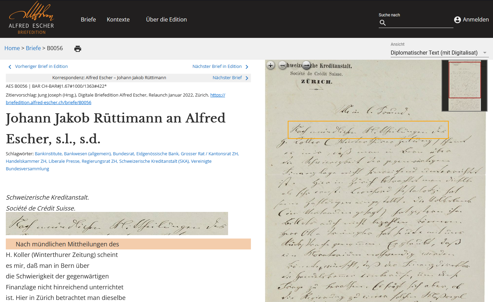
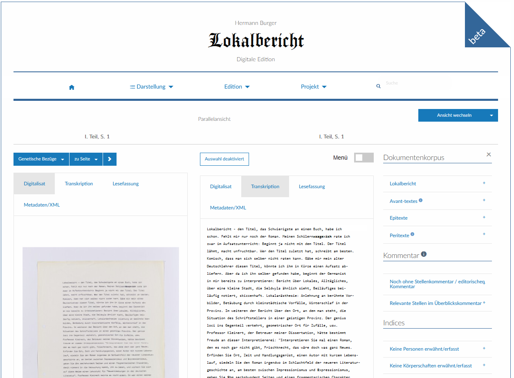
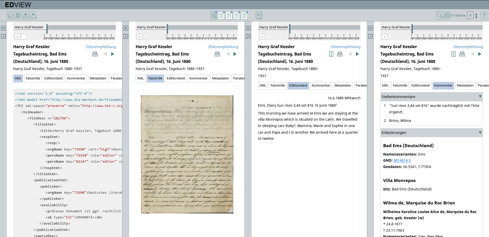
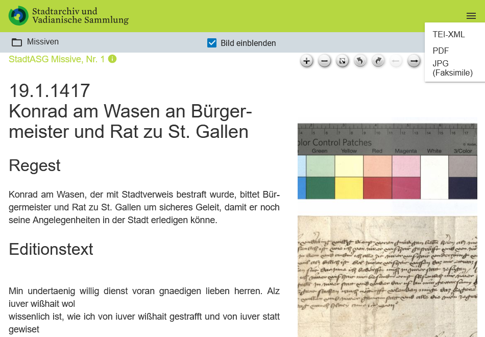

# 3.2 Editionsansichten

Das Herzstück jeder DSE ist die Präsentation des edierten Textes. Über die Minimal-Standards (zweiteiliges Layout und XML-Downloads) scheint sich die DSE-Community in den letzten Jahren einig geworden zu sein, darüber hinaus gibt es jedoch weitere Ansichts- und Download-Funktionen, die im Folgenden ebenfalls diskutiert werden.

## Das zweiteilige Layout

Als Standard-Ansicht hat sich ein **zweiteiliges Layout** etabliert, das aus dem transkribierten und annotierten Text einerseits und dem dreh- und vergrößerbaren Digitalisat andererseits besteht. Der Vorteil dieser Ansicht ist, dass Beziehungen zwischen der Quelle und dem wissenschaftlich aufbereiteten Text unmittelbar erkennbar werden; man spricht hierbei auch vom **autoptischen Vergleich**. Während Druck-Editionen als historisch-kritische Editionen, die in der Regel auf Faksimilie verzichteten, textgenetische Komplexität noch mithilfe eines textkritischen Apparats nachvollziehbar machen mussten, vereinfacht das zweiteilige digitale Layout etwa die Identifizierung fremder Hände, nachträglicher Korrekturen, Poststempel oder paratextueller Ergänzungen. Diese können zwar weiterhin auch im transkribierten Text mittels Annotationen kenntlich gemacht werden, DSE können aber freier abwägen, was durch die Nutzenden identifiziert und was zusätzlich ausgezeichnet werden soll, da die Information des Quellmaterials im Editionsprozess nicht verloren geht.

Der autoptische Vergleich und damit die Beziehung zwischen Digitalisat und Transkriptionstext kann durch die Einblendung von graphischen Elementen auf dem Faksimile unterstützt werden. Da dies eine Präsentationsfunktion ist, die bereits bei der Erstellung der Tranksriptionen vorbereitet werden muss (d.h. auf Datenebene Koordinaten vorliegen müssen), haben wir die **Verknüpfung von Digitalisat und Transkriptionen** bereits im Unterkapitel [_Transkription_](../2_Editionsarbeit/03_Transkription.de.md) vorgestellt.

!!! info "Beispielhafte DSE: Verknüpfung Digitalisat und Transkription"
Für diese Verknüpfung liegt in der [Escher-Briefedition](https://www.briefedition.alfred-escher.ch/home.html) eine Best Practice vor. Es ist jedoch zu beachten, dass die Escher-Briefedition die Entscheidung fordert, entweder das zweiteilige Layout mit Digitalisat und diplomatischer Umschrift oder eine einteilige Darstellung mit dem inhaltlich annotierten Text ("Edierter Text (mit Registereinträgen)") darzustellen. Dies führt einerseits zu mehr Übersichtlichkeit, weil in der Darstellung des annotierten Textes die Register auf der Seite gut sichtbar dargestellt werden können. Andererseits kann an dieser Lösung kritisiert werden, dass inhaltliche Annotation und Digitalisat so nicht gleichzeitig durchgesehen werden können. Das Beispiel zeigt den typischen Konflikt zwischen Übersichtlichkeit und Informationsdichte, der an verschiedenen Stellen in der Präsentation von DSE auftaucht.
 <figcaption>[Jung Joseph (Hrsg.), Digitale Briefedition Alfred Escher, Relaunch Januar 2022, Zürich.](https://briefedition.alfred-escher.ch/briefe/B0056?view1=1){:target="\_blank"} Abgerufen am 22.9.2024.</figure>

## Lesefassungen

Neben dem Digitalisat und dem transkribierten und annotierten Text bieten viele DSE auch eine **Lesefassung** an, die auf der diplomatischen Umschrift (siehe [_Transkription_](../2_Editionsarbeit/03_Transkription.de.md)) aufbaut, jedoch eine **Normalisierung** durchlaufen hat. Das heisst, dass Fehler im Originaltext, inkongruente oder historische Schreibweisen und textkritische Annotationen wie Streichungen oder Unterstreichungen nach klar definierten Editionsrichtlinien korrigiert bzw. einer heute im Druck gebräuchlichen Schreibweise angenähert werden. Fehler werden getilgt, Schreibweisen modernisiert und vereinheitlicht, textkritische Annotationen weggelassen oder vereinfacht (Streichungen fallen weg, Unterstreichungen werden in Kursivierungen geändert). Zudem werden Zeilenumbrüche variabel auf die Bildschirmgröße angepasst und entsprechen nicht länger den Zeilenumbrüchen des Digitalisats (Ausnahmen: Verse, Dramentexte u.ä.).

Die Lesefassung kann auf Datenebene entweder auf einer neuen XML-Datei basieren, oder die XML-Datei der diplomatischen Umschrift wird mithilfe des ODDs anders ausgelesen. Für zweitere Variante ist es nötig, spätestens während der inhaltlichen Annotation im Falle von Korrekturen die korrekten Wortvarianten für die Lesefassung zu annotieren.

Auf der technischen Ebene der Codierung ist in der Erstellung der Lesefassung ein Single-Source-Prinzip vorzuziehen, d.h. die diplomatische Fassung und die Lesefassung ergeben sich durch die Unterscheidung des "mode" mit welchem ein ODD ein einziges XML ausliest ( = single source). Die Lesefassung ist dann, vereinfacht gesagt, eine Vorauswahl bei choice-Elementen und ein Auslassen von Umbrüchen. Mit Dropdowns in TEI-Publisher kann eine Lesefassung auch durch die Wahl verschiedener Darstellungsoptionen kombiniert werden.

## Mehrteilige, variable Layouts

Die **Präsentation der Lesefassung** kann entweder alleinstehend dargestellt werden (ähnlich der oben beschriebenen Präsentation des annotierten Textes in der Escher-Edition) oder in einem **zwei-, drei- bzw. mehrteiliges Layout** mit anderen Ansichten kombiniert werden.

!!! info "Beispielhafte DSE: Zweiteiliges Layout"
Ein Beispiel für eine wahlweise ein- oder zweiteilige Ansicht stellt die [Lokalbericht-Edition](https://www.lokalbericht.ch/synopsis/LB.TEIL1.0010-d/LB.TEIL1.0010-d) dar. Im Gegensatz zur Escher-Briefedition lässt sie in der "Parallelansicht" frei wählen, ob die zwei Teile je aus Digitalisat, Transkription oder Lesefassung einer Seite bestehen. In der "Synopsis"-Ansicht ist es auch möglich, zwei unterschiedliche Digitalisate zu kombinieren, oder eine Lesefassung mit einem Digitalisat, das zu einer anderen Seite gehört, darzustellen.
 <figcaption>[Hermann Burger: Lokalbericht. Digitale Edition.](https://www.lokalbericht.ch/parallel/LB.TEIL1.0010-d/LB.TEIL1.0010-t){:target="\_blank"} Abgerufen am 22.9.2024.</figure>

Auch hier gilt es abzuwägen, wie viel **visuelle und konzeptuelle Komplexität** DSE-Nutzenden zugemutet werden soll. Das beginnt bereits bei der Standard-Einstellung der Ansicht, betrifft aber vor allem die Auswahl, wie viele Ansichten möglich sind. Nicht jede mögliche Darstellung ist auch tatsächlich für Nutzende sinnvoll.

!!! info "Beispielhafte DSE: Mehrteiliges Layout"
Ein Extrem-Beispiel einer mehrteiligen Editionsansicht stellt das Editionsportal des Deutschen Literaturarchivs Marbach [Edview](https://edview.dla-marbach.de/) dar. Edview ist nicht wie eine herkömmliche Website, sondern im Stil eines webbasierten Desktops aufgebaut, der innerhalb des Browsers 'Fenster' öffnet und den Nutzenden viele Konfigurationsmöglichkeiten bietet.

    Komplex ist hier bereits der Einstieg, in dem für die Recherche wahlweise mehrere Editionen ausgewählt werden können. In der eigentlichen Editionsansicht lassen sich so Texte von verschiedenen Editionen gleichzeitig in mehreren Fenstern darstellen. Sichtbar sind wahlweise ein bis vier Fenster, jeder neue Ansichtstyp (XML, Faksimile, Editionstext, Kommentar etc.) erzeugt ein neues Fenster und schiebt bereits geöffnete in einen nicht-sichbtaren Bereich nach links. Die Anzahl Fenster, die durch Miniatur-Symbole zur Ansicht ausgewählt werden können, scheint unbegrenzt. Fenster können für den späteren Gebrauch auch einer virtuellen Ablage hinzugefügt werden.
        <figcaption>[Harry Graf Kessler. Das Tagebuch 1880–1937. Online-Ausgabe 2024.](https://edview.dla-marbach.de/){:target="\_blank"} Abgerufen am 22.9; eine Verlinkung spezifischer Ansichtskonfigurationen ist in Edview nicht möglich. </figure>

## Download der Text-Daten: XML, JPG, PDF, ebooks

DSE bieten mittlerweile oft einfache Möglichkeiten, unterschiedliche Editionsdaten direkt aus der Editionsansicht herunterzuladen (anstatt sie etwa aus einem Repository für Langzeitarchivierung zu holen). Standard ist die Download-Funktion der XML-Datei, interessante Angebote sind aber auch JPGs oder PDFs des Digitalisats sowie PDFs der diplomatischen Umschrift oder der Lesefassung. Noch selten ist die Möglichkeit, Lesefassungen als ebooks (im dafür typischen epub- oder mobi-Format) herunterzuladen. Dies mag daran liegen, dass sich ebooks bislang aufgrund kaum als wissenschaftliches Arbeitsinstrument etabliert haben. Dies kann sich jedoch in Zukunft ändern, wenn bereits heute mögliche technische Funktionen in ebooks (z.B. die Verlinkung von Endnoten) größere Verbreitung finden

!!! info "Beispielhafte DSE: Downloads"
Die (Missiven-Edition)[https://missiven.stadtarchiv.ch/index.html] des Stadtarchivs und der Vadianischen Sammlung St. Gallen ist mit dem TEI-Publisher erstellt und bietet den Download von XML-, JPG- und PDF-Daten jeder Missive an.
 <figcaption> [Download-Möglichkeiten der DSE "Briefverkehr der Stadt St. Gallen 1400-1650. Digitale Missivenedition"](<https://missiven.stadtarchiv.ch/namen/Brandenburg,%20Friedrich%20I.%20von%20(1438%E2%80%93)?&category=B&search=&key=stadtasg-actors-240>){:target="\_blank"}. Aufgerufen am 24.9.2024.</figure>

## Zitiervorschläge

Jede DSE-Seite (primär aus der Edition, idealerweise aber auch aus der Dokumentation und aus verschiedenen Kommentar-Formen) sollte einen **gut sichtbarer Hinweis** aufweisen, wie diese Seite zitiert werden soll. Zentrale Bestandteile des Zitiervorschlags sind die Namen der Editor:innen, des Projektes und der zum angegebenen Zeitpunkt zitierten Version der DSE (falls eine Versionierung vorliegt). Dabei empfiehlt es sich, sich an klassischen Bibliographie-Nomenklaturen zu orientieren.

## Lizenzierung der Daten

Um die Daten als ORD (open research data) bereitzustellen, sollten Links zu den Daten möglichst standardmässig angeboten werden. Damit verbunden ist eine Lizenzierung der Daten als [creative commons](https://creativecommons.org/share-your-work/) beziehungsweise der Hinweis, was die Nutzenden mit urheberrechtlich geschützten Daten tun dürfen. Das Zentrum für Digitale Editionen der UZH ZDE bietet hierfür eine [Handreichung](https://www.zde.uzh.ch/de/offers/handout.html) mit Empfehlungen zu Open Access und einer Übersicht zu den rechtlichen Grundlagen in der Schweiz.
