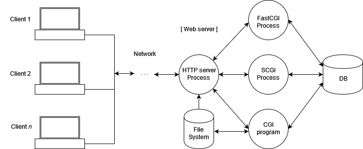
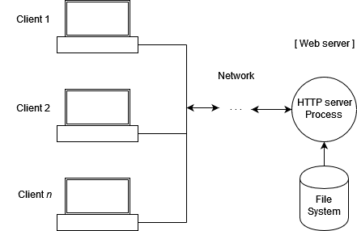

# 4.1 Statische Präsentation

## Warum statische Präsentationen von DSE?

Wie in der Einleitung zur Langzeitsicherung beschrieben, erscheinen statische Präsentationsformen zurzeit (Stand 2024) als erfolgsversprechende Lösung, um eine **langfristige Sicherung einer DSE inklusive der meisten ihrer Nutzerfunktionen** zu gewährleisten. Eine statische DSE-Präsentation besteht primär aus HTML- oder JSON-Dateien, die vorgeneriert wurden. Dadurch fällt die Wartung einer Datenbank, wie sie für dynamische Präsentationen notwendig ist, weg. Domänenspezifisches Wissen über XML-Datenbanken und ihre Langzeitwartung sind somit nicht mehr nötig. Statische Websites können von technischen DH- und DSE-Spezialist:innen z.B. an einen **generalistischen IT-Dienst** einer Forschungs- oder Gedächtnisinstitution übergeben werden, der auch mit der Wartung anderer einfacher Websites betraut ist.

???+ question "Statische vs. dynamische Webpräsentationen"

    **Dynamische Präsentation mit Datenbank**

    

    CC BY-SA 4.0: Ade56facc [https://commons.wikimedia.org/wiki/File:Web_server_serving_static_and_dynamic_content.png](https://commons.wikimedia.org/wiki/File:Web_server_serving_static_and_dynamic_content.png){:target="\_blank"}

    **Statische Präsentation ohne Datenbank**

    

    CC BY-SA 4.0: Ade56facc [https://commons.wikimedia.org/wiki/File:Web_server_serving_static_content.png](https://commons.wikimedia.org/wiki/File:Web_server_serving_static_content.png){:target="\_blank"}

### Abgrenzung zur statischen User-Experience

Unabhängig von obiger Aufteilung in dynamische und statische Präsentationen aufgrund ihrer Implementierung im Server werden die Begriffe _statisch_ und _dynamisch_ auch für die User-Experience verwendet (d.h. die Möglichkeiten, wie mit dem Inhalt von Websites interagiert werden kann).
Das ist allerdings eine Folge der Umsetzung des Frontends, also des Formats _in_ den vorgenerierten Dateien. Dies ist im Folgenden nicht gemeint.

## Statische Präsentation mit dem TEI Publisher 10

In der Version 9 des TEI Publisher ist eine Publikation der DSE nur als dynamische Präsentation vorgesehen. Hierfür wird im TEI Publisher [eine dynamische App generiert](https://teipublisher.com/exist/apps/tei-publisher/documentation/create-app){:target="\_blank"}, die danach gewartet werden muss. Für die Version 10 des Publishers soll ein **statischer Generator** zum zentralen Bestandteil der Publikationsmöglichkeiten werden. Hinzu kommt ein **App Manager**, der den Prozess, eine custom App einer Edition zu machen, automatisiert.
Idealerweise wird es so möglich, verschiedene Versionen von statischen Präsentationen im Verlaufe des Projektes auszugeben und zu testen.

Vorgesehen sind auch Zwischenformen, die gewisse dynamische Funktionen der Präsentation erhalten. Falls diese Funktionen nicht länger gewartet werden können, soll die restliche DSE funktional bleiben.

## Andere statische Präsentationstools

Schon heute existieren tools bzw. scripts, welche die Umwandlung von dynamischen Websites in statische Websites erlauben. Deren Anwendung ist jedoch mit einem größeren technischen Wissen verbunden, als es die Anwendung des oben angekündigten statischen Generators in TEI Publisher verspricht.

-   Bereits für ältere Versionen des TEI Publisher zur Anwendung gekommen ist [Eleventy](https://www.11ty.dev/){:target="\_blank"}. e-editiones hat 2022 ein eigenes [Plugin von Eleventy für den TEI Publisher](https://github.com/eeditiones/tei-publisher-eleventy){:target="\_blank"} entwickelt und seine Benutzung ausführlich [dokumentiert](https://www.e-editiones.org/posts/community-event-going-static/){:target="\_blank"}.

-   Das [Austrian Centre for Digital Humanities and Cultural Heritage (ACDH-CH)](https://www.oeaw.ac.at/acdh/acdh-ch-home){:target="\_blank"} hat mit dem tool [DSE-Static-Cookiecutter](https://github.com/acdh-oeaw/dse-static-cookiecutter?tab=readme-ov-file){:target="\_blank"} einen statischen Website-Generator für DSE entwickelt, der z.B. für verschiedene Editionen zu Arthur Schnitzler zum Einsatz kommt oder kommen soll (Schnitzlers [Tagebuch](https://schnitzler-tagebuch.acdh.oeaw.ac.at){:target="\_blank"}, seine [Briefe](https://schnitzler-briefe.acdh.oeaw.ac.at/){:target="\_blank"} sowie [Briefe und Materialien seiner Korrespondenz mit Hermann Bahr](https://schnitzler-bahr.acdh.oeaw.ac.at/){:target="\_blank"}).
 Der Vorteil dieses tool ist, dass es direkt über eine GitHub-Instanz TEI/XML-Quelldaten auf einem GitHub-Repositorium als statische Website veröffentlichen kann (die [_Archivierung der Daten_](../4_longterm_preservation/03_archiving_data.de.md){:target="\_blank"} und ihre Präsentation sind somit direkt miteinander verknüpft und eine neue Version des Datenstandes führt automatisch zu einer neuen Version der Präsentation).

    Zu beachten bei Lösungen mit **Github** ist jedoch, dass es **nicht** den Anforderungen an eine **FAIRes Repository** genügt. Es wird von einem privaten Anbieter betrieben ohne Vorgaben zu offenen Lizenzen oder Kuratierung der Metadaten, es werden keine PIDs (Persistent Identifiers) vergeben und vor allem existieren Limitationen beim Datenschutz. Eine Übersicht zu den Kriterien von FAIRer Datenarchivierung, bzw. Repositorien gibt die Universitätsbibliothek Zürich [hier](https://www.ub.uzh.ch/de/wissenschaftlich-arbeiten/mit-daten-arbeiten/daten-ablegen-und-teilen.html){:target="\_blank"}. 

-   Zu den weitverbreitetsten tools, die statische Websites generieren, gehört [Jekyll](https://jekyllrb.com/){:target="\_blank"}, das tool hinter der Ausgabe von GitHub-Pages. Eine Anwendung für DSE-Projekte ist uns bislang jedoch nicht bekannt, zumal Jekyll nicht ohne weitere Zwischenschritte bzw. -tools XML-Daten in HTML überführen kann, sondern auf MarkDown-Daten spezialisiert ist.

## Generelle Limitationen

Für komplexe Editionen, die auf eine **grosse Datenbank** angewiesen sind und diese **konstant erweitern** möchten, ist das Generieren einer statischen Präsentation wenig sinnvoll. Zwar ist der Aufruf einer statischen Website schneller, sie bildet jedoch immer nur eine vorgenerierte Momentaufnahme ab, die bei fortlaufendem work in progress schnell veraltet.

Bei der Umwandlung in statische Präsentationen ist ferner zu beachten, dass gewisse **Suchfunktionen** sowie die **Darstellung von Zeitstrahl- oder geografischen Karten-Visualisierungen** wegfallen können. So ist eine statische Präsentation mit dem oben erwähnte TEI Publisher-Plugin von Eleventy auf einfache Suchen beschränkt, d.h. die Möglichkeit einer [Facettensuche](https://de.wikipedia.org/wiki/Facettensuche), wie sie Datenbanken ermöglichen, fällt weg. Visualisierungs-tools, die auf externe Ressourcen zurückgreifen müssen, könnne zwar in eine statische Präsentation integriert blieben, ihr Funktionieren hängt jedoch von der externen Ressource ab.

Bei der Umwandlung in statische Präsentationen ist ferner zu beachten, dass gewisse **Suchfunktionen** sowie die **Darstellung von Zeitstrahl- oder geografischen Karten-Visualisierungen** wegfallen können. So ist eine statische Präsentation mit dem oben erwähnte TEI Publisher-Plugin von Eleventy auf einfache Suchen beschränkt, d.h. die Möglichkeit einer [Facettensuche](https://de.wikipedia.org/wiki/Facettensuche), wie sie Datenbanken ermöglichen, ist eingeschränkt oder benötigt eine technisch versiertere Aufbereitung des Such-Indexes. Visualisierungs-tools, die auf externe Ressourcen zurückgreifen müssen, können zwar in eine statische Präsentation integriert blieben, ihr Funktionieren hängt jedoch von der externen Ressource ab.

## Limitationen von Datenformaten zur statischen Präsentation

Im folgenden werden mit HTML und JSON die beiden wichtigsten Datenformate vorgestellt, in die für statische Präsentationen TEI/XML-Daten konvertiert werden müssen. Der Abschnitt richtet sich primär an technisch geschulte Editor:innen. 

### HTML-basierte Präsentationen

Die **radikalste Umsetzung** ist eine Konvertierung der Editionsdaten in HTML-Dateien, die so statisch sind, wie ein gedrucktes Buch.
Inhalt und Form sind in dieser Form nicht mehr getrennt.
Mit HTML sind die Daten in einem langlebigen Format, das ohne Aufwand auch offline im Webbrowser genutzt werden kann.

Nachteilig ist, dass verschiedene Ansichten desselben Inhalts separat konvertiert werden müssen und sie pro Datei separate Pfade bekommen.
Die **Verlinkung** zwischen verschiedenen Inhalten ist somit direkt an die Konvertierung gekoppelt und muss bei Überarbeitungen berücksichtigt werden.

Ausserdem sind in reinen HTML-Präsentationen ohne Datenbank **keine Suchfunktionen** möglich.Hier muss man sich auf externe Anbieter wie Suchmaschinen beschränken oder einen hybriden Ansatz verfolgen, bei dem einzelne Ansichten wie die Suche in JavaScript umgesetzt werden.

HTML-basierte Editionen müssen von Grund auf als solche entwickelt werden.
Als Werkzeug bieten sich XSLT-Konvertierungen an.

==->@Wie nachhaltig ist eine XSLT-Konvertierung on the fly im Browser?

### JSON-basierte Präsentationen

Weniger radikal ist die Nutzung von JSON-Dateien mit dem Inhalt äquivalent zu den Daten von der Datenbankschnittstelle. HTML wird nur als Format für die einzelnen Properties verwendet.
Der Umbau bestehender Präsentationen in statische ist bei diesem Ansatz auch **relativ spät** möglich und die dynamische User-Experience kann bewahrt werden.

Nachteilig ist die **Abhängigkeit von schnelllebigen JavaScript-Libraries** (v.a. für Volltextsuche) und dass die Edition auch auf dem lokalen Computer nur über HTTP benützt werden kann.

**Suchfunktionen** können über Libraries wie [FlexSearch](https://github.com/nextapps-de/flexsearch){:target="\_blank"} im Browser ausgeführt werden.
Das Datenformat der Indexdaten folgt der jeweiligen Library und ein Umbau entspricht einer Neuimplementierung. Das Laden des Suchindexes führt bei grossen Datenbeständen zu mehr Datenverkehr.